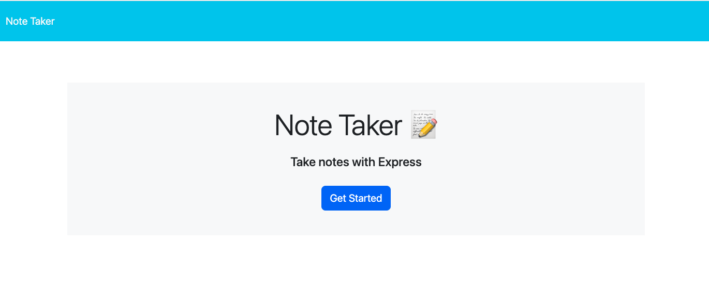
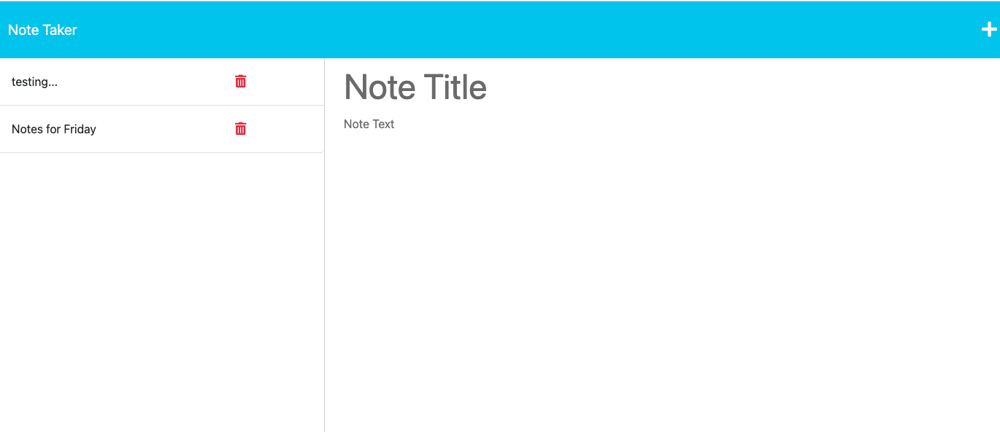

# Note Taker Application
User will use Heroku application to write and save notes

## Description
This Heroku application allows users to dynamically generate and organize notes. When users opens the Note Taker they are presented with a landing page, when user clicks the link, they are taken to the note page. On the note page, existing notes are listed on the left-hand column plus empty fields to enter a new note title and note's text. There is a save button in the upper right hand portion of screen and when note is saved, it will appear in the left hand column. A delete button is next to saved notes to delete when user is finished with note. 

[GitHub Repo](https://github.com/kristinbrewer/note-taker)

## Table of Contents
- [Description](#description)
- [Installation](#installation)
- [Usage](#usage)
- [License](#license)
- [Contributing](#contributing)
- [Tests](#tests)
- [Questions](#questions)

## Installation
Node.js with express.js for back-end build, Heroku for deployment 

## Usage
Navigate to deployed Heroku link, click starter link, add/delete notes as desired.

## License
MIT Copyright (c) 2022 kristinbrewer
Permission is hearby granted, free of charge, to any person obtaining a copy of this software and associated documentation files (the "Software"), to deal in the Software without restriction, including without limitation the rights to use, copy, modify, merge, publish, distribute, sublicense, and/or sell copies of the Software, and to permit persons to whom the Software is furnished to do so, subject to the following conditions: The above copyright notice and this permission notice shall be included in all copies or substantial portions of the Software. THE SOFTWARE IS PROVIDED ”AS IS”, WITHOUT WARRANTY OF ANY KIND, EXPRESS OR IMPLIED, INCLUDING BUT NOT LIMITED TO THE WARRANTIES OF MERCHANTABILITY, FITNESS FOR A PARTICULAR PURPOSE AND NONINFRINGEMENT. IN NO EVENT SHALL THE AUTHORS OR COPYRIGHT HOLDERS BE LIABLE FOR ANY CLAIM, DAMAGES OR OTHER LIABILITY, WHETHER IN AN ACTION OF CONTRACT, TORT OR OTHERWISE, ARISING FROM, OUT OF OR IN CONNECTION WITH THE SOFTWARE OR THE USE OR OTHER DEALINGS IN THE SOFTWARE. 

## Contributing
Kristin Brewer

## Tests
N/a

## Questions
For more information, my GitHub account is: [kristinbrewer](https://github.com/kristinbrewer).
Please email me at: brewer.kristin17@gmail.com with any additional questions. 